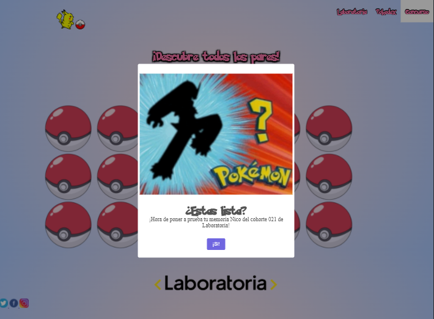
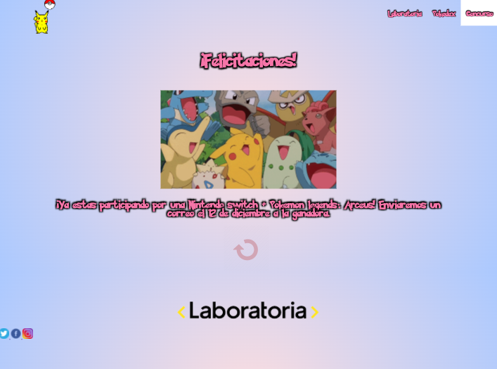

# Memory Match Game

## Índice

- [1. Breve descripción del proyecto](#1-breve-descripción-del-proyecto)
- [2. Historias de usuario](#2-historias-de-usuario)
- [3. Prototipo de baja fidelidad](#3-prototipo-de-baja-fidelidad)
- [4. Prototipo de alta fidelidad](#4-prototipo-de-alta-fidelidad)
- [5. Funcionalidades](#5-funcionalidades)
- [6. Diseño Final](#6-diseño-final)
- [7. Pendiente](#7-pendiente)

---

## 1. Breve descripción del proyecto "Pokematch"

Memory match es un juego de cartas en donde todas estas se distribuyen boca abajo y la usuaria va descubriendo de a dos en dos con el fin de conseguir pares iguales hasta que todas esten con su respectiva pareja.
El contexto de nuestro proyecto es un concurso para las egresadas y estudiantes de Laboratoria en el cual el único requisito es ingresar el cohorte y nombre.
En Pokematch se dispone de 18 cartas para dar vuelta y encontrar los pares en un tiempo de 40 segundos, si esto se consigue el usuario estará participando por una Nintendo Switch + Pokemon legends: Arceus, de no completar el tablero en el tiempo indicado se le llevará a una pantalla de game over en donde podrá reingresar al juego.

## 2. Historias de Usuario

Como primer paso decidimos realizar un formulario haciendo diversas preguntas para investigar el interés que existe en la comunidad de laboratoria por la industria de pokemón y sus juegos. Para esto consultamos principalmente por rangos etarios, género, accesibilidad a las consolas de juego e interés en participar del concurso. con esta data concluimos que el 48,1% tiene entre 26 y 30 años, el 96,3% es de género femenino, el 55,6% ya es usuario de juegos de ppkemón y el 80% lo hace desde su telefóno móvil, el 63% no tiene una consola de nintendo switch y el 74,1% esta interesado en ganar esta consola. Es en vista de los datos anteriores que decidimos utilizar la tematica de pokemon para nuestro juego de memory match, la paleta de colores existente y también darle el contexto de consurso por una consola de nintendo switch.

## 3. Prototipo de baja fidelidad

## 4. Prototipo de alta fidelidad

## 5. Funcionalidades

Nuestro juego de pokematch cuenta con diversas funcionalidades tales como revolver las cartas en cada partida, permitir que el usuario destape de dos en dos haciendo click en el reverso de cada logo de pokebola y que estas se queden destapadas en caso de ser iguales y de lo contrario volver a cubrirse, mostrando el lado del reverso nuevamente. Además agregamos un cronómetro de 40 segundos para agregar un poco más de dificultad y para hacerlo más personalizado recogemos los datos de las jugadoras en la página inicial y luego las saludamos por su nombre cuando comienza el juego.

## 6. Diseño Final

## 7. Pendiente

-Implementar timer, sin embargo el juego tiene la funcionalidad básica para que el usuario pueda completar el juego una vez descubra todas las parejas. Si hubieramos implemetado el timer lo habriamos conectado con la página 4 de game over cuando se complete el tiempo sin quer el usuario terminara de descubrir las parejas.
